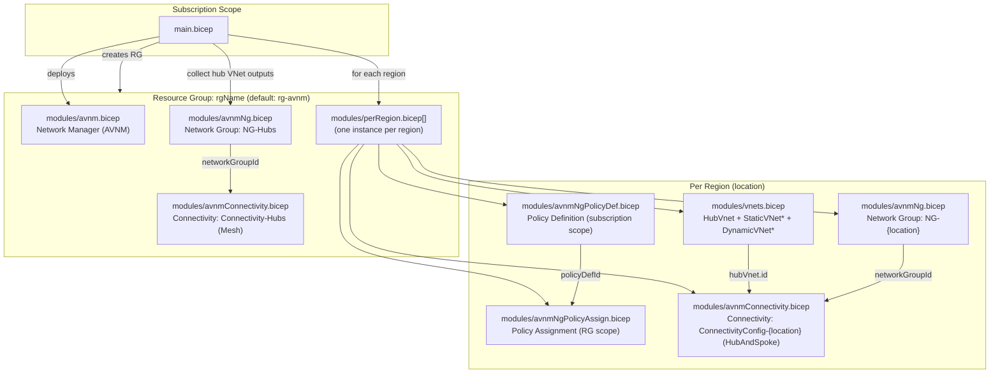

# Azure-AVNM (Bicep)

This repository deploys an **Azure Virtual Network Manager (AVNM)** lab environment using **Bicep**, including:

- An AVNM (Network Manager)
- Per-region hub + spoke VNets
- Per-region AVNM network groups
- Per-region AVNM connectivity configurations (Hub-and-Spoke)
- Azure Policy definition + assignment to demonstrate **dynamic** network group membership
- A separate “hub-only” network group and a “hubs” connectivity configuration

Deployment entrypoint: `main.bicep` (subscription-scope).

## Architecture



## Repository structure

- `main.bicep`: subscription-scope orchestration (RG + AVNM + per-region deployments)
- `modules/`
	- `avnm.bicep`: creates the AVNM instance (Network Manager)
	- `perRegion.bicep`: per-region orchestration (VNets, network group, policy, connectivity)
	- `vnets.bicep`: hub VNet + static VNets + dynamic VNets
	- `avnmNg.bicep`: AVNM network group creation
	- `avnmConnectivity.bicep`: AVNM connectivity configuration creation
	- `avnmNgPolicyDef.bicep`: policy definition for dynamic membership
	- `avnmNgPolicyAssign.bicep`: policy assignment for that definition

## Prerequisites

- Azure subscription access with permissions to:
	- deploy subscription-scope templates
	- create a resource group
	- create VNets
	- create AVNM resources
	- create and assign Azure Policy (policy modules)
- PowerShell + Az modules:
	- `Az.Accounts`, `Az.Resources`, `Az.Network`
- Bicep CLI available on PATH (Az tooling can invoke it automatically)

## Deploy

From the repo root:

```powershell
Connect-AzAccount
Set-AzContext -Subscription <subscriptionId>

New-AzSubscriptionDeployment \
	-Name avnm \
	-Location SwedenCentral \
	-TemplateFile .\main.bicep \
	-Verbose
```

### Deploy with custom parameters

```powershell
New-AzSubscriptionDeployment \
	-Name avnm \
	-Location SwedenCentral \
	-TemplateFile .\main.bicep \
	-TemplateParameterObject @{
		rgName = 'rg-avnm'
		avnmName = 'AVNM01'
		vnetCount = 3
		regions = @(
			@{ location = 'swedencentral'; cidr = '172.16.0.0/16' }
			@{ location = 'germanywestcentral'; cidr = '172.32.0.0/16' }
		)
	}
```

## Parameters (main.bicep)

| Name              |   Type | Default                         | Description                                   |
| ----------------- | -----: | ------------------------------- | --------------------------------------------- |
| `avnmName`        | string | `AVNM01`                        | Name of the Azure Virtual Network Manager     |
| `avnmDescription` | string | `Azure Virtual Network Manager` | AVNM description                              |
| `tags`            | object | `{}`                            | Tags applied to resources that support tags   |
| `vnetCount`       |    int | `3`                             | Number of static and dynamic VNets per region |
| `rgName`          | string | `rg-avnm`                       | Resource group name                           |
| `regions`         |  array | (see file)                      | Array of `{ location, cidr }` objects         |

## What the per-region deployment creates

For each region in `regions`:

- Hub VNet: `HubVnet-<location>`
- Static VNets: `StaticVNet<i>-<location>` (tag: `avnmManaged=false`)
- Dynamic VNets: `DynamicVNet<i>-<location>` (tag: `avnmManaged=true`)
- Network Group: `NG-<location>`
- Connectivity configuration: `ConnectivityConfig-<location>` (Hub-and-Spoke)
- Policy definition (subscription scope) + policy assignment (to demonstrate dynamic membership)

## Connectivity configuration details

This repo creates connectivity configurations under:

`Microsoft.Network/networkManagers/connectivityConfigurations`

### Hub payload shape (Hub-and-Spoke)

When topology is `HubAndSpoke`, hubs are expressed as:

```json
{
	"resourceId": "/subscriptions/.../resourceGroups/.../providers/Microsoft.Network/virtualNetworks/<hubVnet>",
	"resourceType": "Microsoft.Network/virtualNetworks"
}
```

### API version note

`modules/avnmConnectivity.bicep` uses a stable API version (`2022-11-01`) for `connectivityConfigurations`.
Several boolean-like fields in this resource are **strings** (`"True"` / `"False"`) per the ARM schema.

## Validate

```powershell
# Subscription deployment status
Get-AzSubscriptionDeployment -Name avnm | Select-Object ProvisioningState, CorrelationId, Timestamp

# Network Manager
Get-AzNetworkManager -ResourceGroupName rg-avnm | Select-Object Name, Location, ProvisioningState

# Connectivity configurations
Get-AzNetworkManagerConnectivityConfiguration -ResourceGroupName rg-avnm -NetworkManagerName AVNM01
```

## Troubleshooting

### “Deployment canceled” / nested deployment failure

If a per-region deployment fails and a nested deployment shows `Canceled`, list the operations to find the first failure:

```powershell
$rg = 'rg-avnm'
$dep = 'perRegion-swedencentral'

Get-AzResourceGroupDeploymentOperation -ResourceGroupName $rg -DeploymentName $dep |
	Select-Object OperationId, ProvisioningState, StatusCode, TargetResource, StatusMessage
```

### Internal errors when creating connectivity configuration

If ARM returns internal mapping/deserialization errors, first verify:

- `hubs[].resourceType` is exactly `Microsoft.Network/virtualNetworks`
- you’re using a known-stable API version for `connectivityConfigurations`

## Local build

```powershell
bicep build .\main.bicep
```

This produces `main.json` in the repo root.

## Clean up

To remove everything deployed by default, delete the resource group:

```powershell
Remove-AzResourceGroup -Name rg-avnm -Force
```

