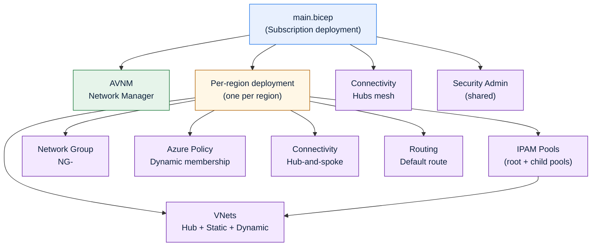

# Azure Virtual Network Manager (AVNM) Starter Lab (Bicep)

This repository is for people **just starting with Azure Virtual Network Manager (AVNM)**.
It deploys a safe, repeatable lab using **Bicep** and is designed to **showcase the major AVNM feature areas** end-to-end:

- **Scopes & access**: one AVNM that manages resources in your subscription
- **Network Groups**: organize VNets into logical groups
- **Group membership**:
	- **Static membership** (explicitly add specific VNets)
	- **Dynamic membership** (Azure Policy automatically adds VNets based on tags)
- **Connectivity Configurations**: build hub-and-spoke per region, plus a hubs-only mesh
- **Routing Configurations**: centrally push routing rules for a group
- **Security Admin Configurations**: centrally author security admin rules (deny high-risk, unencrypted traffic)
- **IP Address Management (IPAM) pools**: allocate address space to VNets/subnets from AVNM IPAM pools

Deployment entrypoint: `main.bicep` (subscription scope).

> Note on AVNM “deployment / publish”
>
> AVNM configurations (connectivity/routing/security admin) are **created as resources** by this repo.
> In AVNM, changes typically need to be **deployed/committed** from AVNM to your target scope before they take effect.
> Use the Azure portal’s AVNM experience to deploy the configurations after creation.

## What you get (high level)

For each region you specify, the lab creates:

- A **hub VNet**: `HubVnet-<location>`
- **Static VNets**: `StaticVNet<i>-<location>` (tagged `avnmManaged=false`)
- **Dynamic VNets**: `DynamicVNet<i>-<location>` (tagged `avnmManaged=true`)
- An **AVNM Network Group**: `NG-<location>`
- A **Connectivity configuration** (hub-and-spoke) targeting `NG-<location>`
- A **Routing configuration** targeting `NG-<location>`
- **IPAM pools** for the region (root + two child pools)

At the subscription level (shared across regions), the lab also creates:

- A **hub-only Network Group**: `NG-Hubs`
- A **hubs mesh Connectivity configuration**: `ConnectivityConfig-Hubs`
- A **Security Admin configuration** that applies rules across all per-region network groups

## AVNM features explained (and how this repo demonstrates them)

### 1) Network Manager (AVNM)

**What it is:** The AVNM resource is the “control plane” you use to centrally manage groups, connectivity, routing, and security intent across many VNets.

**How this repo uses it:**
- Creates a single AVNM with scope to the current subscription
- Enables scope accesses: **Connectivity**, **Routing**, and **SecurityAdmin**

### 2) Network Groups

**What it is:** A Network Group is a set of VNets (or subnets) you manage as a unit.

**How this repo uses it:**
- Creates one group per region: `NG-<location>`
- Creates one “hubs only” group: `NG-Hubs`

### 3) Static vs Dynamic membership (Azure Policy + tags)

**What it is:**
- **Static** membership = you explicitly add specific VNets as members.
- **Dynamic** membership = VNets are added automatically based on rules (for example, tags).

**How this repo uses it:**
- Static VNets are created and explicitly added to the per-region group.
- Dynamic VNets are tagged `avnmManaged=true` and then Azure Policy adds them to the group automatically.

This gives you a simple pattern to teach:

- “If I tag a VNet as AVNM-managed, it becomes part of the group.”

### 4) Connectivity Configurations

**What it is:** Connectivity configurations let you centrally define peering topology.

**How this repo uses it:**
- **Per-region hub-and-spoke** connectivity: spokes are the VNets in `NG-<location>`, hub is `HubVnet-<location>`.
- **Hubs mesh** connectivity: hub VNets are placed into `NG-Hubs` and connected in a mesh.

### 5) Routing Configurations

**What it is:** Routing configurations let you centrally define routing rules and apply them to a Network Group.

**How this repo uses it:**
- Creates a routing configuration per region.
- Creates a default rule that sends `0.0.0.0/0` to a **virtual appliance next hop**.

This is intentionally “lab-like”: the next hop address is emitted as a placeholder output so you can see the mechanics of centralized routing.

### 6) Security Admin Configurations

**What it is:** Security Admin lets you centrally author and apply security rules (separate from NSGs) across groups.

**How this repo uses it:**
- Creates a Security Admin config and applies a rule collection to all per-region groups.
- Demonstrates a practical baseline by **denying unencrypted / high-risk outbound ports** (for example Telnet, FTP, SMTP, POP3, IMAP).

### 7) IP Address Management (IPAM) Pools

**What it is:** AVNM IPAM pools provide centralized IP planning and allocation.

**How this repo uses it:**
- For each region, creates a root IPAM pool and two child pools.
- VNets and their subnets reference IPAM pool allocations via `ipamPoolPrefixAllocations`.

If you’re new to IPAM, the key learning outcome is:

- The VNet/subnet doesn’t hardcode CIDRs; it asks an IPAM pool for prefixes.

## Architecture



## Repository structure

- `main.bicep`: subscription-scope orchestration
- `modules/`
	- `avnm.bicep`: creates the AVNM instance
	- `perRegion.bicep`: per-region orchestration (VNets, IPAM, network group, policy assignment, connectivity, routing)
	- `vnets.bicep`: hub + static + dynamic VNets, with IPAM pool allocations
	- `avnmNg.bicep`: AVNM network group + static members
	- `avnmNgPolicyDef.bicep`: policy definition for dynamic membership (effect: `addToNetworkGroup`)
	- `avnmNgPolicyAssign.bicep`: assigns the definition with a location selector
	- `avnmConfigConnectivity.bicep`: AVNM connectivity configurations
	- `avnmConfigRouting.bicep`: AVNM routing configurations
	- `avnmConfigSecurity.bicep`: AVNM security admin configurations and rules
	- `avnmIPAM.bicep`: AVNM IPAM pools
	- `avnmIpamPolicyDef.bicep`: optional policy definition to audit/deny VNets without IPAM allocation

## Prerequisites

- Azure subscription access with permissions to:
	- deploy subscription-scope templates
	- create a resource group
	- create VNets and related network resources
	- create AVNM resources
	- create and assign Azure Policy
- PowerShell + Az modules (at minimum): `Az.Accounts`, `Az.Resources`, `Az.Network`
- Bicep CLI available on PATH (Az tooling can invoke it automatically)

## Deploy

From the repo root:

```powershell
Connect-AzAccount
Set-AzContext -Subscription <subscriptionId>

New-AzSubscriptionDeployment \
	-Name avnm \
	-Location SwedenCentral \
	-TemplateFile .\main.bicep \
	-Verbose
```

### Deploy with custom parameters

```powershell
New-AzSubscriptionDeployment \
	-Name avnm \
	-Location SwedenCentral \
	-TemplateFile .\main.bicep \
	-TemplateParameterObject @{
		rgName = 'rg-avnm'
		avnmName = 'AVNM01'
		vnetCount = 3
		regions = @(
			@{ location = 'swedencentral'; cidr = '172.16.0.0/16' }
			@{ location = 'germanywestcentral'; cidr = '172.32.0.0/16' }
		)
	}
```

## Parameters (main.bicep)

| Name              |   Type | Default                         | Description                                   |
| ----------------- | -----: | ------------------------------- | --------------------------------------------- |
| `avnmName`        | string | `AVNM01`                        | Name of the Azure Virtual Network Manager     |
| `avnmDescription` | string | `Azure Virtual Network Manager` | Description for the AVNM resource             |
| `tags`            | object | `{}`                            | Tags applied to taggable resources            |
| `vnetCount`       |    int | `3`                             | Number of static and dynamic VNets per region |
| `rgName`          | string | `rg-avnm`                       | Resource group name                           |
| `regions`         |  array | (see file)                      | Array of `{ location, cidr }` objects         |

## Validate (quick checks)

```powershell
# Subscription deployment status
Get-AzSubscriptionDeployment -Name avnm | Select-Object ProvisioningState, CorrelationId, Timestamp

# Resource group
Get-AzResourceGroup -Name rg-avnm

# Network Manager
Get-AzNetworkManager -ResourceGroupName rg-avnm | Select-Object Name, Location, ProvisioningState
```

### Validate: Network Groups and membership

Start with a simple sanity check in the portal:

- Open your Network Manager → **Network groups**
- Confirm you see `NG-<location>` and `NG-Hubs`
- Check that:
	- static VNets appear as members (static members)
	- dynamic VNets become members after policy evaluation (dynamic membership)

### Validate: IPAM allocations on VNets

You should see that the VNets were created with IPAM pool allocations:

```powershell
$rg = 'rg-avnm'
Get-AzVirtualNetwork -ResourceGroupName $rg |
	Select-Object Name, Location, AddressSpace, IpamPoolPrefixAllocations
```

### Validate: Connectivity / Routing / Security Admin configurations exist

These resources should exist under the Network Manager:

- `Microsoft.Network/networkManagers/connectivityConfigurations`
- `Microsoft.Network/networkManagers/routingConfigurations`
- `Microsoft.Network/networkManagers/securityAdminConfigurations`

> Reminder: you may still need to deploy/commit configurations in AVNM for changes to take effect.

## Optional: IPAM compliance policy

The repo includes `modules/avnmIpamPolicyDef.bicep` as a separate example policy definition that can **audit or deny** VNets without IPAM pool allocations.
It’s not deployed by `main.bicep` by default, so you can opt-in when you’re ready.

## Local build

```powershell
bicep build .\main.bicep
```

## Clean up

To remove everything deployed by default, delete the resource group:

```powershell
Remove-AzResourceGroup -Name rg-avnm -Force
```

